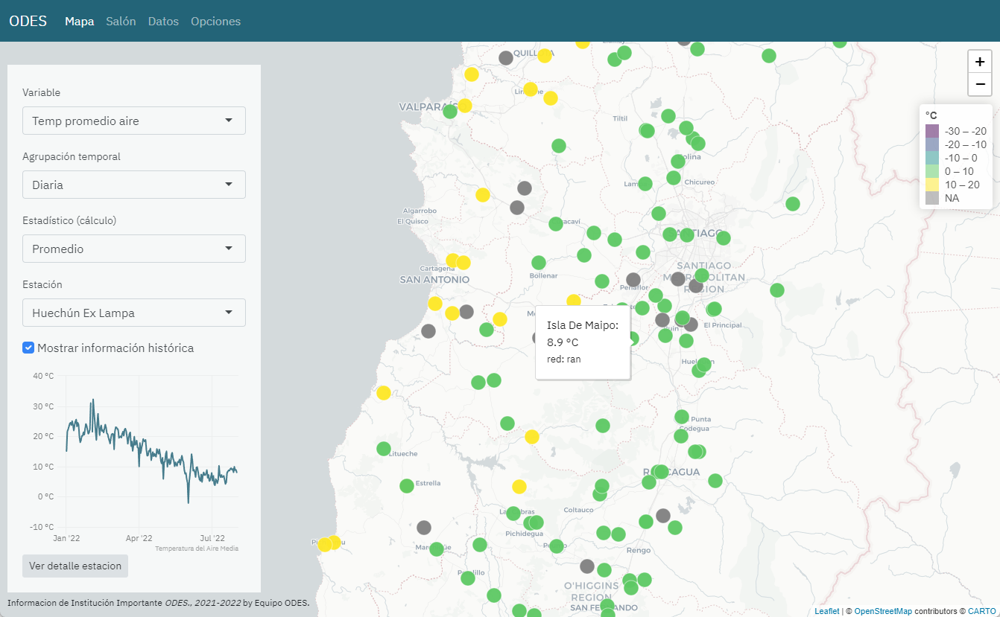
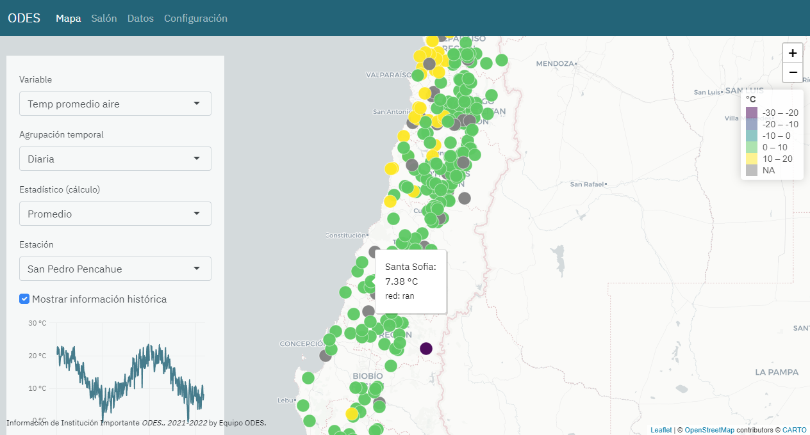
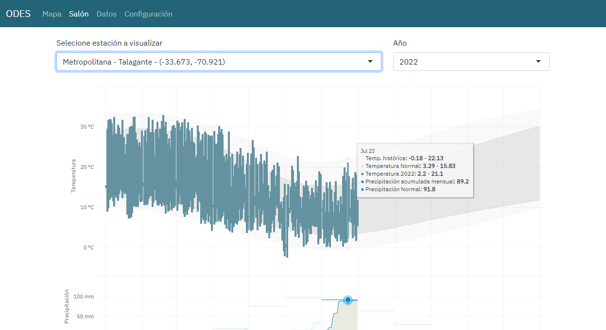
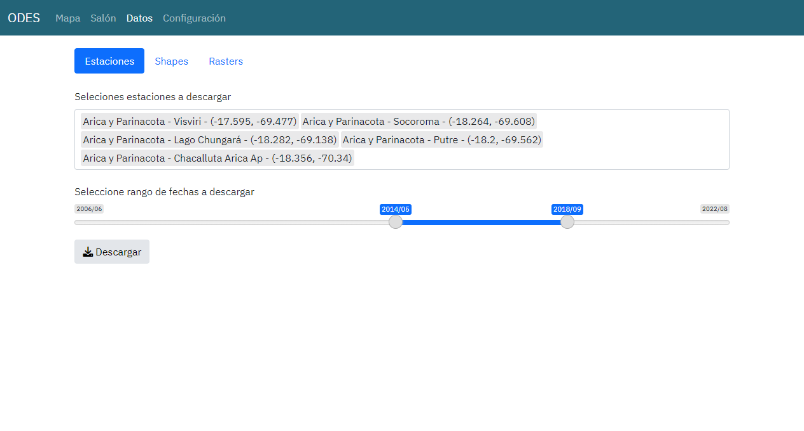
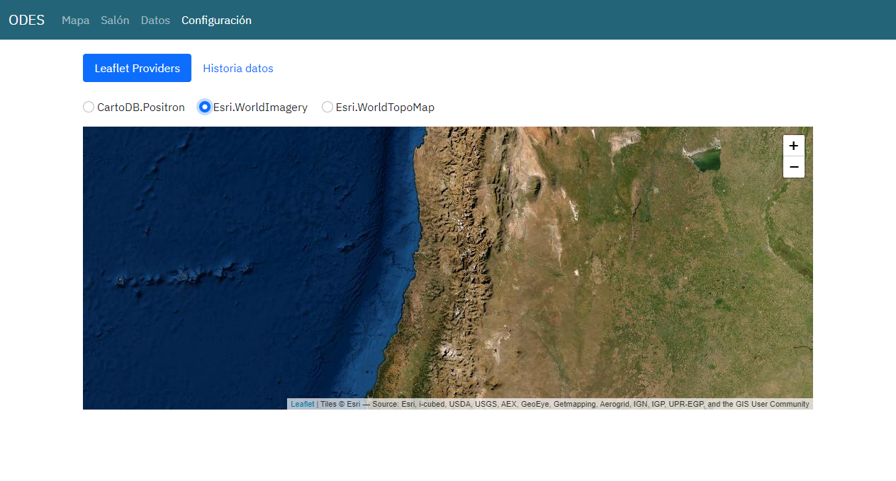

```{r setup, include=FALSE}
options(htmltoolsdirversion = FALSE)
knitr::opts_chunk$set(
  figwidth=9, figheight=35, figretina=3,
  outwidth = "100%",
  cache = FALSE,
  echo = FALSE,
  message = FALSE, 
  warning = FALSE,
  hiline = TRUE
)

library(tidyverse)
library(lubridate)
library(RPostgres)
library(pool)

sysfonts::font_add_google("Raleway")
showtext::showtext_auto()

sql_con <- function() {
  pool::dbPool(
    drv = RPostgres::Postgres(),
    dbname = "shiny",
    host = Sys.getenv("HOST"),
    user = "shiny",
    password = Sys.getenv("SHINY_PSQL_PWD")
  )
}

theme_set(theme_minimal() + theme(legend.position = "bottom"))
```

```{r xaringan-themer, include=FALSE, warning=FALSE}
library(xaringanthemer)
style_duo_accent(
  primary_color = "#F2EDD0",
  secondary_color = "#E8AF47",
  
  black_color = "#333333",
  
  header_color = "#A63E26",
  
  header_font_google = xaringanthemer::google_font("Raleway", 400),
  text_font_google = xaringanthemer::google_font("Raleway"),
  
  text_font_size = "1.5rem", # 1rem default
  
)
```

## Plataforma de Visualización ODES

```{r}

```


---

## ¿Qué veremos?

--- 

- Características generales/particulares

--

- Secciones de la aplicación

--

- Datos que alimentan la plataforma

--

- Desarrollo adicionales


--

- Próximos pasos


---
class: center, middle, inverse

# Características


---

## Características Generales

--- 

- Aplicación web para visualización de datos de estaciones meteorológicas

--

- Información histórica de estaciones de las redes RAN y DMC (actualmente)


---

## Características Particulares (e internas)

--- 

- Visualizador para presentar de forma simple y atractiva la información

--

- Secciones para distintos perfiles de usuarios: general, tomador de decisión, experto

--

- (Interna) Aplicación desarrollada con *R* usando el paquete *shiny*


---
class: center, middle, inverse

# Secciones

---

## Secciones

--- 

Actualmente la aplicación posee:


- Mapa

- Salón de temperaturas y lluvias (nombre en desarrollo)

- Descarga de datos

- Configuración/Opciones


---

## Secciones: Mapa

```{r}

```


---

## Secciones: Salón

```{r}

```


---

## Secciones: Datos

```{r}

```

---

## Secciones: Opciones

```{r}

```

---
class: center, middle, inverse

# Datos

---

## Datos que alimentan plataforma: Estaciones

.pull-left[
```{r}
destaciones <- tbl(sql_con(), "estaciones") |>
  collect() |> 
  mutate(red = str_to_upper(red))
```

Datos de `r nrow(destaciones)` estaciones. 

```{r, results='asis'}
destaciones |> 
  count(red, name = "cantidad", sort = TRUE) |> 
  knitr::kable()
```


]

.pull-right[
```{r}
library(chilemapas)  # gracias Pachá!

ggplot(destaciones) +
  geom_sf(
    data = rmapshaper::ms_simplify(chilemapas::generar_regiones()), aes(geometry = geometry),
    alpha = 0.1, size = 0.2, fill = "gray80", color = "gray90"
    ) +
  geom_point(aes(longitud, latitud, color = red), size = 2) +
  scale_color_viridis_d(begin = 0.1, end = 0.9) + 
  theme_void() +
  scale_x_continuous(limits = c(-80, -65)) +
  scale_y_continuous(limits = c(-55, -19)) +
  labs(color = NULL)
```
]

---

## Datos que alimentan plataforma: RAN

```{r, fig.width = 12, fig.height = 5, dev = "svg"}
readRDS("../../agrometR/dev/plot_hist_agromet.rds") +
  scale_fill_viridis_c(begin = 0.05, end = 0.95, na.value = "transparent") + 
  scale_x_date(breaks = "year", date_labels = "%Y") +
  scale_y_discrete(labels = NULL, breaks = NULL) +
  theme_minimal() +
  theme(legend.position = "bottom", legend.key.width=unit(0.1,"npc")) +
  labs(y = NULL, x = NULL, fill = NULL)
```

API de agromet.cl 

---

## Datos que alimentan plataforma: DMC

```{r, fig.width = 12, fig.height = 5, dev = "svg"}
readRDS("../../agrometR/dev/plot_hist_dmc.rds") +
  scale_fill_viridis_c(begin = 0.05, end = 0.95, na.value = "transparent") + 
  scale_x_date(breaks = "year", date_labels = "%Y") +
  scale_y_discrete(labels = NULL, breaks = NULL) +
  theme_minimal() +
  theme(legend.position = "bottom", legend.key.width=unit(0.1,"npc")) +
  labs(y = NULL, x = NULL)
```

API de climatologia.meteochile.gob.cl

---
class: center, middle, inverse

# Desarrollos Adicionales

---

## Desarrollos/creaciones Adicionales

--- 

Hemos desarrollado herramientas y procesos adicionales.


- Paquete R *AgrometR* https://github.com/ODES-Chile/odes-chile

- Proceso GHA para actualización de BBDD automática 

- Creación de la organicación *ODES-Chile* en github

---

`r flipbookr::chunk_reveal("agrometdemo", title = "## AgrometR", widths = c(1, 2), chunk_options = "dev='svg',fig.height=6, fig.width=10")`

```{r agrometdemo, include = FALSE}
library(agrometR)

get_agro_data(
  1:4, 
  "2022-06-01 01:00:00",
  "2022-08-02 01:00:00"
  ) |>
  mutate(station_id = factor(station_id)) |> 
  ggplot(
    aes(fecha_hora,
        temp_promedio_aire,
        color = station_id
        )
  ) +
  geom_line(alpha = 0.4, size = 1.2) +
  geom_smooth(se = FALSE) +
  facet_wrap(vars(station_id))
```

## Actualización BD por GithubActions

--- 

https://github.com/ODES-Chile/gha-odes-ddbb-update

Proceso automático diario de actualización de datos


- Descargar los últimos datos utilizando agrometR

-- 

- Envia a los datos a una BD (que es lo que la app usa)

-- 

- Genera un informe adicional de la cantidad de registros

---
class: center, middle, inverse

# Próximos pasos

---

## Próximos pasos

--- 

Corto plazo:

- Seguir mejorando la usabilidad de la aplicación
- Mejorar respuesta de tiempos de la BD
- Incoporar colores y tipografías del proyecto


Mediano/largo plazo:

- Incorporar resto de productos y análisis: raster, nieves, indicadores


---
class: center, middle, inverse

# Demo time https://jbkunst.shinyapps.io/odes-chile/
